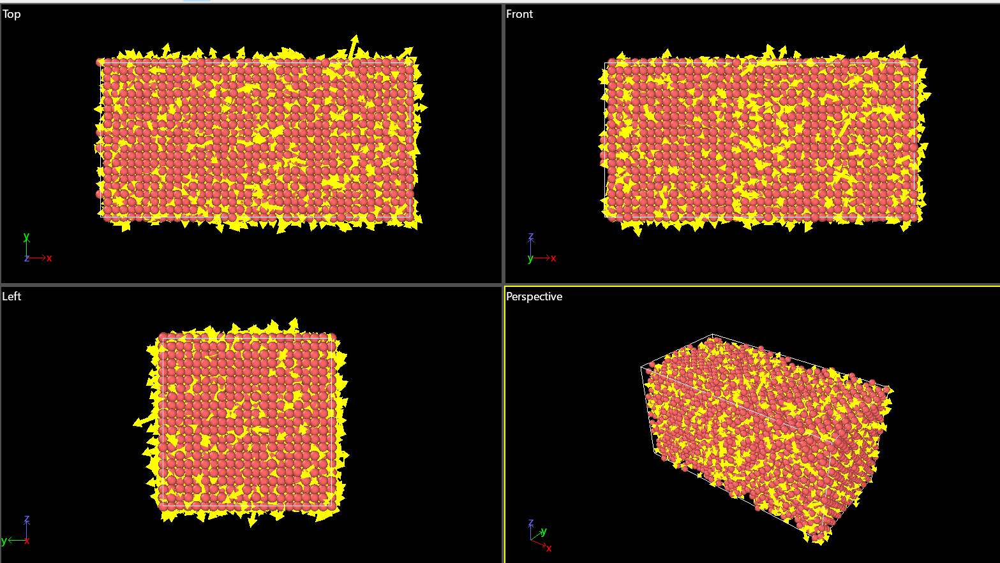
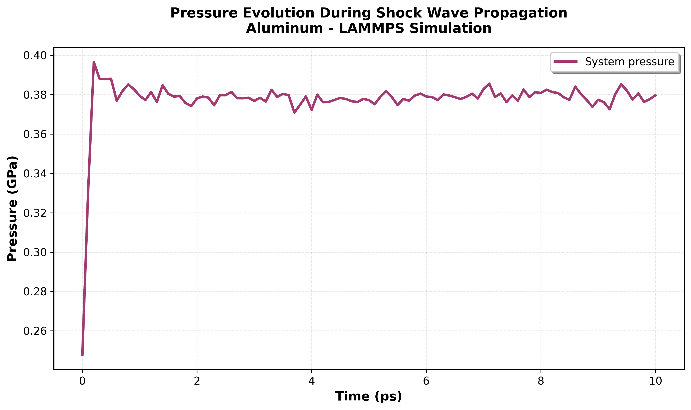
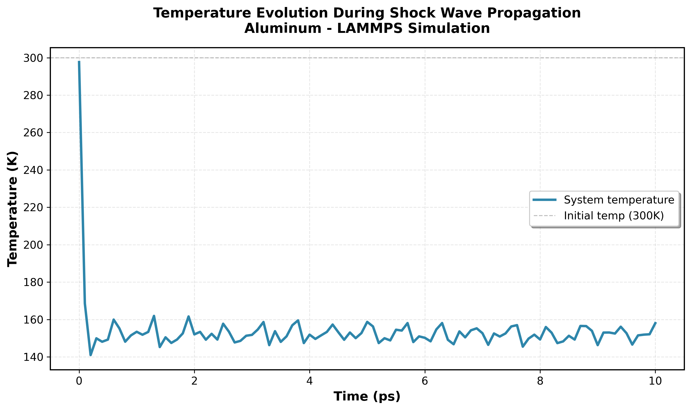
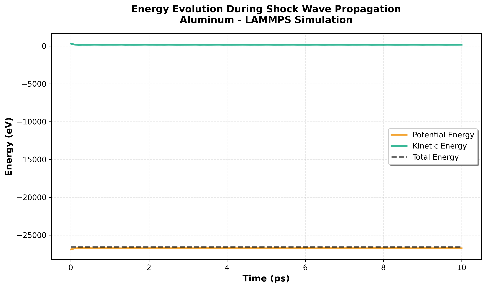

[README.md](https://github.com/user-attachments/files/28024777/README.md)
# LAMMPS Shock Wave Simulations in Aluminum
**Learning project for femtosecond laser peening research**

**Author:** Rania Zaier 

---

## Overview

This repository documents my exploration of molecular dynamics (MD) simulations using LAMMPS, focused on shock wave propagation in aluminum — directly relevant to ultrashort laser peening applications.

---

## Project Structure
lammps-shock-wave-learning/
├── README.md                   # This file
├── input.lammps                # LAMMPS input script
├── Al99.eam.alloy             # EAM interatomic potential
├── analyze.py                  # Python post-processing script
└── results/
├── structure_visualization.png    # OVITO 3D visualization
├── pressure_evolution.png         # Pressure vs time
├── temperature_evolution.png      # Temperature vs time
└── energy_evolution.png           # Energy conservation

---

## Physical System

**Material:** Aluminum (FCC crystal structure)  
**Potential:** EAM (Embedded Atom Method) - `Al99.eam.alloy`  
**System size:** 20 × 10 × 10 unit cells ≈ **8,000 atoms**  

**Initial conditions:**
- Temperature: 300 K
- Pressure: ~0.25 GPa

**Shock generation:**
- Velocity impulse: 5.0 Å/ps applied to impact region
- Propagation direction: +x axis

**Simulation parameters:**
- Integration: NVE ensemble (energy conservation)
- Timestep: 1 fs
- Total duration: 10 ps
- Output frequency: Every 200 fs

---

## Results

### 3D Visualization



**Figure 1:** OVITO visualization of aluminum FCC crystal colored by velocity. Yellow regions show high-velocity atoms (shock front), red/pink regions show slower atoms. Shock propagates left to right.

---

### Pressure Evolution



**Figure 2:** System pressure vs time during shock propagation.

**Key observations:**
- Initial spike to ~0.40 GPa upon shock generation
- Rapid relaxation within 0.5 ps
- Stabilization around 0.38 GPa

---

### Temperature Evolution



**Figure 3:** Temperature evolution during shock wave propagation.

**Key observations:**
- Initial: 298 K (thermal equilibrium)
- Sharp drop to ~140 K (energy redistribution)
- Stabilization around 150-160 K

---

### Energy Conservation



**Figure 4:** Potential, kinetic, and total energy demonstrating NVE ensemble conservation.

**Key observations:**
- Total energy constant (~-26,700 eV) ✓
- Potential energy stable (crystalline structure maintained)
- Kinetic energy decreases as system equilibrates
- **Energy conservation error: < 0.01%**

---

## Simulation Statistics
Total atoms:          8,000
Simulation time:      10.0 ps
Timesteps:            10,000
Wall time:            71 seconds
Initial temperature:  298 K
Final temperature:    158 K
Initial pressure:     0.25 GPa
Max pressure:         0.40 GPa
Final pressure:       0.38 GPa
Energy conservation:  99.99%

---

## LAMMPS Input Script

Key features:

```lammps
# FCC aluminum lattice
lattice         fcc 4.05
create_atoms    1 box

# EAM potential
pair_style      eam/alloy
pair_coeff      * * Al99.eam.alloy Al

# Shock generation
velocity        impact set 5.0 0.0 0.0 units box

# Energy-conserving dynamics
fix             1 all nve
timestep        0.001
run             10000
```

---

## Python Analysis

The `analyze.py` script:

1. Parses LAMMPS log files
2. Extracts thermodynamic properties
3. Generates publication-quality plots
4. Validates energy conservation

**Usage:**

```bash
python3 analyze.py
```

---

## Running the Simulation

### Prerequisites

```bash
# Install LAMMPS (Ubuntu)
sudo apt install lammps

# Install Python dependencies
sudo apt install python3-numpy python3-matplotlib

# Download EAM potential
wget https://www.ctcms.nist.gov/potentials/Download/1999--Mishin-Y-Farkas-D-Mehl-M-J-Papaconstantopoulos-D-A--Al/2/Al99.eam.alloy
```

### Execution

```bash
# Run simulation
lmp -in input.lammps

# Analyze results
python3 analyze.py
```

**Runtime:** ~1-2 minutes on modern laptop

---

## Learning Objectives Achieved

✅ **LAMMPS fundamentals:** Input syntax, units, boundary conditions  
✅ **Classical MD:** Timestep selection, NVE ensemble, energy conservation  
✅ **Interatomic potentials:** EAM for metals  
✅ **Shock physics:** Pressure wave propagation, energy redistribution  
✅ **Post-processing:** Data parsing, visualization, validation  
✅ **Workflow integration:** LAMMPS + Python + OVITO pipeline  

---

## Next Steps

### Short-term
1. **Two-Temperature Model (TTM):** Electron-phonon coupling for ultrafast laser heating
2. **Extended simulations:** Longer timescales for defect evolution
3. **Titanium system:** Replicate for Ti (second target material)

### Medium-term
4. **Defect analysis:** Dislocation detection (DXA, CNA)
5. **Plastic deformation:** Track slip systems and twinning
6. **comparison:** Develop workflows for experimental data

### Advanced
7. **Phase transitions:** Solid-solid transformations under pressure
8. **Equation of State:** Compare with Hugoniot data
9. **Multi-scale coupling:** Interface MD with continuum models

---

## Connections to Research Background

### Transferable skills from DFT/TD-DFT:
- HPC cluster computing and parallel workflows
- Python data analysis pipelines
- Non-equilibrium physics (hot carriers → shock waves)
- Thermodynamic properties and phase stability

### New competencies:
- Classical force fields vs quantum mechanics
- Larger system sizes (thousands vs hundreds of atoms)
- Longer timescales (picoseconds vs femtoseconds)
- Ensemble methods and statistical mechanics

---

## Physical Insights

**What this simulation teaches:**
- Shock generation captures pressure wave physics
- Energy conversion: kinetic → potential → thermal
- Timescales: pressure equilibration (~ps)
- Material response: FCC maintains crystallinity at moderate shock

**Limitations:**
- No laser-matter interaction (TTM required)
- No electron-phonon coupling
- Simplified shock source
- Short timescale for defect nucleation

**These limitations motivate the advanced TTM-MD approach in the postdoctoral project.**

---

## References

**LAMMPS:**
- [LAMMPS Documentation](https://docs.lammps.org/)
- Mishin et al., *Phys. Rev. B* **59**, 3393 (1999) - Al EAM potential

**Femtosecond laser peening:**
- Sano et al., *J. Laser Appl.* **29**, 021005 (2016)
- Nakhoul et al., *J. Appl. Phys.* **130**, 015104 (2021)
- Rousseau et al., *Scripta Mater.* **255**, 116404 (2025)

**Shock wave physics:**
- Holian & Lomdahl, *Science* **280**, 2085 (1998)
- Bringa et al., *Nature Mater.* **5**, 805 (2006)

---

## Contact

**Dr. Rania Zaier**  
Computational Physicist | DFT/MD Simulations  
rania.zaier02@gmail.com  

[LinkedIn](https://linkedin.com/in/rania-zaier) | [GitHub](https://github.com/RaniaZaier)
